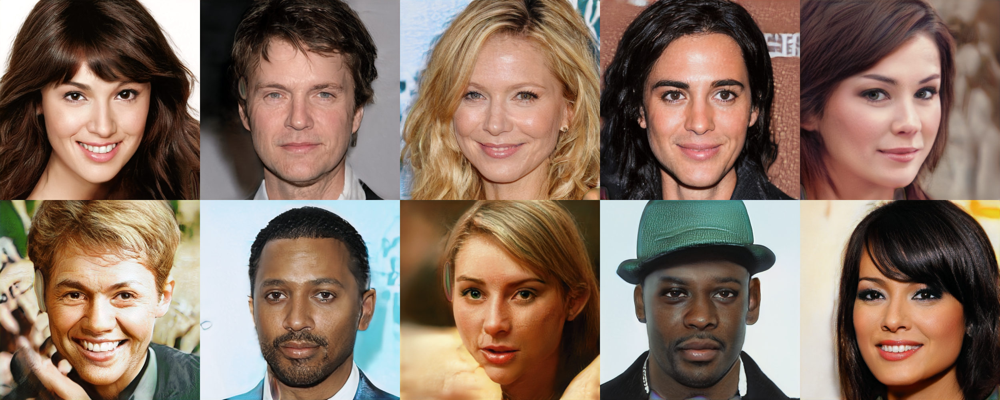

# pretrained_celebahq.py

### A bit fine-tuning of pretrained_example.py

* Use CelebA-HQ pretrained model
* Set the number of generated images

### Environment

* Windows 10
* NVIDIA GeForce GTX 970
* Python 3.6.10
* conda 4.8.3
* tensorflow-gpu 1.10.0
* numpy 1.18.5
* cuda 9.0
* Newest pillow, image, requests, ...

### Implementation

* [Download](https://drive.google.com/file/d/1MT9USX2Q8rKxDtVBs1fHn6pw7PRXhqvF/view?usp=sharing) pretrained model (.pkl) and move it to the home directory (the same directory with README)

* Directly modify "image_num" as the number of images you want to generate.
* Changing the parameter in "rnd = np.random.RandomState()" may provide different results.
* The generated images will be saved at "C:/stylegan/result". You can change the directory in "config.py".
* *(TODO: add arguments for image_num and directory?)*
