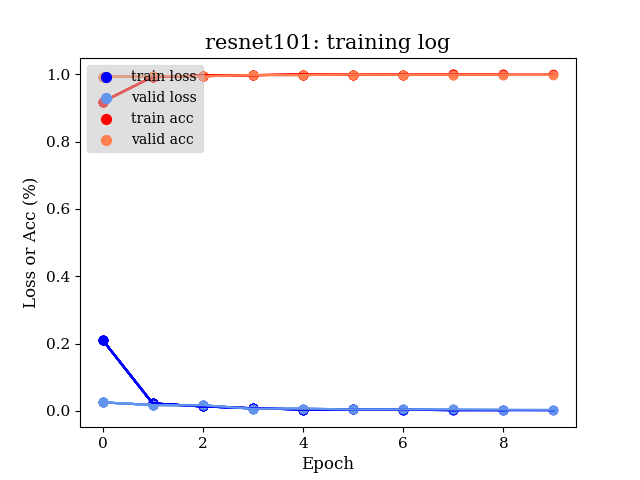
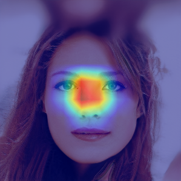

# GAN Detection By Classification

우리는 GAN을 통해 생성된 가짜 이미지를 판별하는 문제를 이미지 분류(image classification) 문제에 대응시켜서 해결할 수 있을 것이라 판단하였다. 즉, 이미지 속의 대상이 개, 고양이, 코끼리인지 분류하는 이미지 분류 문제와 마찬가지로 주어진 이미지가 여러 GAN 모델 중 어떤 모델을 통해서 생성되었는지 판별할 수 있을 것이라 생각했다. 실제로 manipulation detection을 다룬 기존 연구들에서 각각의 GAN 모델은 이미지를 생성할 때 특유의 fingerprint를 남긴다고 하였다 [1], [2]. GAN fingerprint는 사람의 눈으로는 판별할 수 없는 미세한 패턴이지만 딥러닝 모델을 통해서는 추출이 가능한 특징이기 때문에 진짜인지 가짜인지 파악하기 어려운 정교한 합성 이미지에 대해서도 효과적으로 진위를 구별해낼 수 있다.

## 실험 셋업
Classification 기반으로 GAN detection이 가능할 것이라는 가정하에 우리는 2가지 방식의 실험을 진행하였다. 첫 번째는 binary classification 실험으로, 진짜 이미지와 여러 GAN 모델을 통해 생성된 합성 이미지들을 통해 모델이 'real'과 'fake'를 판별해내도록 모델을 학습시켰다. 두 번째는 multi-class classification으로, 4가지 GAN 모델을 통해 생성된 가짜 이미지들을 통해서 주어진 이미지가 어떠한 GAN을 통해 생성이 되었는지 분류해내도록 모델을 학습하였다.

### 학습 데이터
GAN 연구에서 흔히 사용되는 CelebA-HQ(1024 x 1024)와 FFHQ(1024 x 1024)를 통해 학습된 4가지 GAN을 통해서 가짜 이미지들을 생성하였다. GAN은 MSG-GAN, StyleGAN, PGGAN, VGAN을 사용하였고, 각각의 GAN 모델들에서 1만 장의 HQ 이미지를 생성하여 총 4만장의 데이터셋을 구성하였다. Multi-class classification에서는 CelebA-HQ 데이터셋으로 학습된 GAN 모델들로 생성한 이미지를 사용하였고, Real-fake binary classification에서는 FFHQ 이미지 원본은 real label 데이터로, FFHQ로 학습된 GAN 모델들이 생성한 이미지를 fake label 데이터로 사용하였다.

### 실험 환경
- 18-core Intel Xeon E5-2695 @ 2.10 GHz and an NVIDIA Titan X GPU 2개.
- Ubuntu 18.04, CUDA 10.1, cuDNN 7, Python 3.7.7
- GAN 이미지 생성에는 TF v1.15.0을, GAN Detection에는 PyTorch v1.6.0을 활용하였다.

## Binary Classification

</img>

'real'과 'fake'를 판별하는 첫 번째 실험에서는 ImageNet으로 사전 학습된 ResNet-50를 baseline network로 사용하였다. Linear classifier 부분만 binary classification을 하도록 수정하여 fine-tuning한 결과 위의 그림과 같이 99%의 정확도를 보였다. 즉, ImageNet으로 사전 학습된 네트워크를 manipulation detection task에 효과적으로 활용하는 것이 가능하며, image classification에서 얻을 수 있는 정확도 보다 높은 정확도를 얻을 수 있다. 사람에게는 사진 속의 대상이 개인지 고양이인지 알아 맞추는 것이 정교한 가짜 이미지를 보고 진위를 판별해내는 것보다 훨씬 쉬운 일이지만 딥러닝에서는 진짜, 가짜를 판별하는 것이 훨씬 쉬운 일이라고 할 수 있다.

## Multi-Class Classification

앞에서 'real'과 'fake'를 판별하는 것은 쉽게 해결될 수 있음을 확인하였다. 그렇다면 task의 난이도를 높여서 주어진 합성 이미지가 어떤 GAN을 통해 만들어진 것인지 판별하는 것도 가능할까? Binary classification에서와 마찬가지로 baseline network의 classifier를 4개의 class(MSG-GAN, StyleGAN, PGGAN, VGAN)에 대한 logit을 계산하도록 바꾼 뒤 ImageNet에서 사전 학습된 weight를 적용하여 fine-tuning을 하였다. 이번에는 ResNet-50 뿐 아니라 ResNet-101, Xception도 baseline network로 추가하여 실험을 진행하였다.

</img>

</img>

실험 결과 ResNet과 Xception 모두 binary classification에서와 마찬가지로 99%의 정확도에 도달할 수 있었다. 'real', 'fake'를 판별하는 것 뿐아니라 주어진 이미지가 MSG-GAN, StyleGAN, PGGAN, VGAN 중 어떤 모델에서 생성된 것인지 구분하는 것 역시 완벽에 가깝게 해낼 수 있다. 'real', 'fake'를 판별하는 것은 사람의 눈으로도 어느 정도는 구분이 가능하지만 가짜 이미지가 어떤 모델에서 생성된 것인지 판별하는 것은 사람에게는 거의 불가능한 일이다.

우리는 detection model에서 어떻게 이를 잘 구분해 내는 것인지 확인하기 위해 Grad-CAM을 생성하였다. 아래의 예시들은 특정 GAN에서 생성된 이미지가 입력으로 주어졌을 때 Xception을 baseline으로 한 GAN detection 모델의 12번째 블록에서 뽑은 Grad-CAM의 결과들이다. Grad-CAM에서 색칠된 부분은 모델이 해당 클래스로 이미지를 분류할 때 가장 큰 비중을 둔 곳으로 파란색에서 빨간색으로 갈수록 비중의 값이 크다. 아래의 예시들에서 볼 수 있듯, 각각의 GAN마다 Grad-CAM이 찍히는 부분의 패턴이 존재한다. 실제로 여러 이미지들에 대해 Grad-CAM을 생성한 결과 예시와 같은 패턴이 규칙적으로 발생함을 확인할 수 있었다. 이를 통해 Manipulation detection 시에 dection 모델은 이미지 상에서 어색한 신체 부분(e.g. 눈, 코, 입, 귀)을 통해 진위를 판별하거나 GAN의 종류를 구분해 내는 것이 아니라, GAN의 아키텍처 특징에 따라서 발생하는 노이즈 패턴을 포착하여 판단을 함을 알 수 있다.

**1) MSG-GAN**

</img>

**2) StyleGAN**

</img>

**3) PGGAN**

</img>

**4) VGAN**

</img>

# Reference
[1] F. Marra, D. Gragnaniello, L. Verdoliva, and G. Poggi, “Do GANs Leave Artificial Fingerprints?” in Proc. IEEE Conference on Multime- dia Information Processing and Retrieval, 2019, pp. 506–511.
[2] M. Albright and S. McCloskey, “Source Generator Attribution via Inversion?” in Proc. Conference on Computer Vision and Pattern Recognition Workshops, 2019.